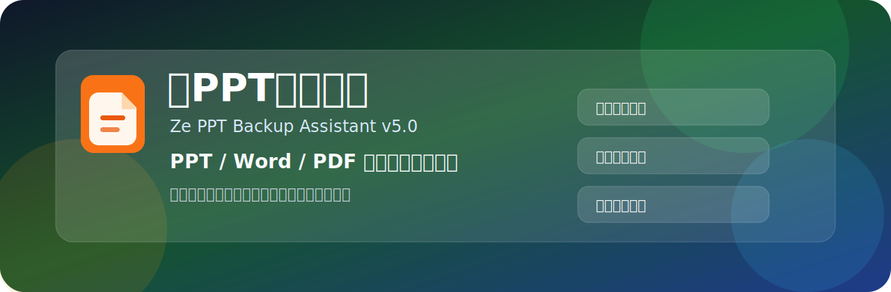

<div align="center">
  

  <h1>泽PPT备份助手 / Ze PPT Backup Assistant</h1>

  <p>
    面向教室、会议室、培训电脑的 PPT / Word / PDF 本地自动备份工具。<br>
    A lightweight Windows tool for local backup of PPT, Word, and PDF files.
  </p>

  <p>
    
  </p>

  <p>
    <a href="https://github.com/zeningshuyi-hub/ze-ppt-backup-assistant/raw/main/%E5%8F%91%E5%B8%83%E5%8C%85-releases/v5.0/%E6%B3%BDPPT%E6%A0%87%E5%87%86%E5%A4%87%E4%BB%BD%E7%89%88.zip">
      
    </a>
    <a href="https://github.com/zeningshuyi-hub/ze-ppt-backup-assistant/blob/main/%E6%96%87%E6%A1%A3-docs/%E8%AF%A6%E7%BB%86%E5%8A%9F%E8%83%BD%E5%AE%8C%E6%95%B4%E8%AF%B4%E6%98%8E.txt">
      
    </a>
  </p>
</div>

---

## 一句话介绍 / What It Does

泽PPT备份助手会在后台检测当前电脑打开的 PowerPoint、WPS 演示、Word/WPS 文字以及常见 PDF 文件，并自动复制到本地备份目录。

它适合不方便要求使用者手动拷贝文件的电脑环境，例如教室、会议室、培训室、机房或公共演示电脑。

Ze PPT Backup Assistant runs in the background and keeps local copies of opened PPT, Word, and PDF files, so important classroom or meeting files are easier to find later.

> [!IMPORTANT]
> 请在本人或已授权的电脑上使用本软件。因未获授权使用、误操作、数据丢失、隐私纠纷等造成的后果，由使用者自行承担。

---

## 快速下载 / Quick Start

| 你想做什么 | 入口 |
| --- | --- |
| 获取成品压缩包 | [下载泽PPT标准备份版.zip](https://github.com/zeningshuyi-hub/ze-ppt-backup-assistant/raw/main/%E5%8F%91%E5%B8%83%E5%8C%85-releases/v5.0/%E6%B3%BDPPT%E6%A0%87%E5%87%86%E5%A4%87%E4%BB%BD%E7%89%88.zip) |
| 查看完整使用说明 | [详细功能完整说明.txt](https://github.com/zeningshuyi-hub/ze-ppt-backup-assistant/blob/main/%E6%96%87%E6%A1%A3-docs/%E8%AF%A6%E7%BB%86%E5%8A%9F%E8%83%BD%E5%AE%8C%E6%95%B4%E8%AF%B4%E6%98%8E.txt) |
| 查看版本更新 | [CHANGELOG.txt](CHANGELOG.txt) |
| 查看售后排查话术 | [售后排查说明.txt](https://github.com/zeningshuyi-hub/ze-ppt-backup-assistant/blob/main/%E6%96%87%E6%A1%A3-docs/%E5%94%AE%E5%90%8E%E6%8E%92%E6%9F%A5%E8%AF%B4%E6%98%8E.txt) |
| 查看客户交付话术 | [客户交付话术.txt](https://github.com/zeningshuyi-hub/ze-ppt-backup-assistant/blob/main/%E6%96%87%E6%A1%A3-docs/%E5%AE%A2%E6%88%B7%E4%BA%A4%E4%BB%98%E8%AF%9D%E6%9C%AF.txt) |

使用方式很简单：

1. 解压 `泽PPT标准备份版.zip`。
2. 双击运行 `泽PPT备份助手.exe`。
3. 第一次运行时确认免责声明。
4. 正常打开 PPT、Word 或 PDF 文件。
5. 到备份目录或主界面查看自动保存的副本。

---

## 工作流程 / Workflow

<div align="center">
  
</div>

---

## 核心功能 / Features

| 功能 | 说明 |
| --- | --- |
| 自动检测文件 | 支持 PPT、PPTX、PPS、PPSX、DOC、DOCX、DOCM、RTF、WPS、PDF |
| 本地自动备份 | 默认优先保存到 D 盘和 E 盘，盘符不可用时自动启用备用位置 |
| 日期分类保存 | 每天自动建立日期文件夹，方便按上课日期或会议日期查找 |
| 重名自动编号 | 同名文件不会互相覆盖，会自动生成 `_2`、`_3` 等编号 |
| 后台托盘运行 | 默认静默运行，不主动打扰授课、会议或演示 |
| 主界面查看记录 | 双击右下角托盘图标可查看最近备份、打开目录、打开日志 |
| 一键体检 | 可快速复制运行状态，方便售后判断问题 |
| 磁盘空间保护 | 可限制每个备份位置最多占用 2GB、5GB、10GB、20GB 或 50GB |
| 自定义备份格式 | 可只备份 PPT，也可按需启用 Word、PDF |
| 自定义备份位置 | 可选择自己的保存目录，也可恢复默认 D/E/C 自动规则 |
| 删除与清理 | 支持删除选中记录、清理失效记录、清空记录、清空日志 |

---

## 默认备份目录 / Default Backup Folders

默认优先保存到：

```text
D:\泽宁PPPPPPPPTTTT备份\
E:\泽宁PPPPPPPPTTTT备份\
```

如果 D/E 盘不可用，会自动保存到：

```text
C:\泽宁PPPPPPPPTTTT备份\
```

如果 C 盘根目录也不可写，会保存到当前用户文档目录。

示例：

```text
D:\泽宁PPPPPPPPTTTT备份\2026-04-19\数学课件.pptx
E:\泽宁PPPPPPPPTTTT备份\2026-04-19\数学课件.pptx
```

---

## 适用场景 / Use Cases

| 场景 | 解决的问题 |
| --- | --- |
| 教室电脑 | 老师打开课件后，学生或管理员不需要再用 U 盘手动拷贝 |
| 会议室电脑 | 会后能快速找到当天打开过的 PPT、Word、PDF |
| 培训机构 | 多场培训资料可以按日期自动留存 |
| 公共演示电脑 | 降低文件遗漏、重名覆盖、忘记复制的概率 |
| 冰点还原环境 | 可将备份目录放到不会被还原的 D/E 盘 |

---

## 常见问题 / FAQ

**为什么运行后没有主窗口？**

软件默认在右下角托盘后台运行。请点任务栏右下角的小箭头，找到“泽PPT备份助手”图标，双击即可打开主界面。

**文件备份在哪里？**

默认在 `D:\泽宁PPPPPPPPTTTT备份\` 和 `E:\泽宁PPPPPPPPTTTT备份\`。如果没有 D/E 盘，会自动使用 C 盘或文档目录。主界面里的“打开当前备份”可以直接打开实际保存位置。

**能不能只备份 PPT？**

可以。打开主界面，点击“备份格式”，只保留 PPT 即可。

**能不能修改保存位置？**

可以。打开主界面，点击“备份位置”，选择你想保存的目录。留空或选择使用默认规则后，会恢复 D/E/C 自动选择。

**占用空间太大怎么办？**

打开主界面，点击“空间保护”，设置每个备份位置最多占用空间。超过限制后，软件会优先清理最旧的备份文件，不会删除源文件。

**PDF 为什么有时检测不到？**

PPT 和 Word 通常比较稳定。PDF 没有统一接口，部分阅读器不会暴露本地文件路径。遇到这种情况，建议使用 WPS、Edge、Adobe Reader 或 Foxit 打开 PDF。

**杀毒软件提示怎么办？**

这是个人开发的本地工具，没有数字签名，部分安全软件可能会提示风险。请确认文件来源可信后再运行，也可以将软件目录加入信任。

---

## 仓库结构 / Repository Structure

```text
素材-assets/
  banner.svg
  workflow.svg

源码-src/
  ZeBackupAssistant.cs

文档-docs/
  详细功能完整说明.txt
  客户交付话术.txt
  售后排查说明.txt

发布包-releases/v5.0/
  泽PPT标准备份版.zip
  发布说明.md

CHANGELOG.txt
README.md
```

---

## 编译说明 / Build

本项目为 C# WinForms 单文件程序，可使用 .NET Framework 4.x 自带的 `csc.exe` 编译。

```powershell
$src = "源码-src\ZeBackupAssistant.cs"
$out = "泽PPT备份助手.exe"
$csc = "C:\Windows\Microsoft.NET\Framework64\v4.0.30319\csc.exe"
& $csc /nologo /codepage:65001 /target:winexe /platform:anycpu "/out:$out" `
  /reference:Microsoft.CSharp.dll `
  /reference:System.Windows.Forms.dll `
  /reference:System.Drawing.dll `
  /reference:System.Management.dll `
  $src
```

---

## 反馈 / Feedback

有建议或者问题，欢迎反馈到：

```text
zeningshuyi@gmail.com
```

关键词：PPT 自动备份、课件备份、PowerPoint 文件备份、WPS 课件留存、Word PDF 本地备份、教室电脑文件备份。
